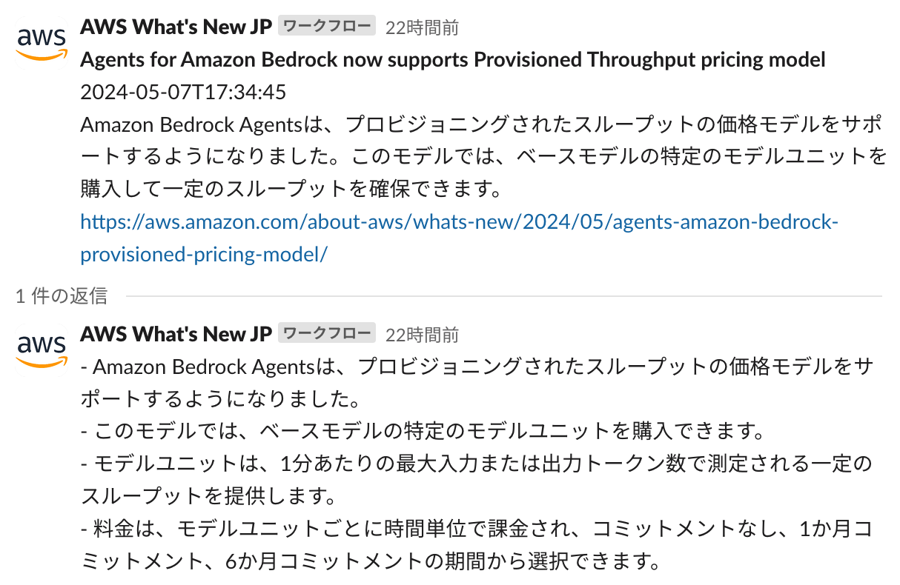
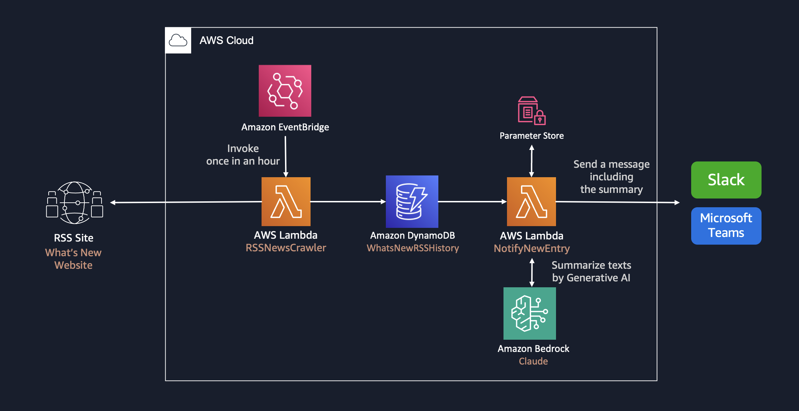

# Whats New Summary Notifier

**Whats New Summary Notifier** は、AWS 最新情報 (What's New) などのウェブ記事に更新があった際に記事内容を Amazon Bedrock で要約し、Slack や Microsoft Teams への配信を行う生成 AI アプリケーションのサンプル実装です。

<p align="center">
  
</p>

## アーキテクチャ



## 前提条件
- Unix コマンドを実行できる環境 (Mac、Linux、...)
  - そのような環境がない場合は、AWS Cloud9 を使用することも可能です。[操作環境の準備 (AWS Cloud9)](DEPLOY_ja.md) をご参照ください。
- aws-cdk
  - `npm install -g aws-cdk` でインストール可能です。詳しくは [AWS ドキュメント](https://docs.aws.amazon.com/cdk/v2/guide/getting_started.html)を参考にしてください。
- Docker 
  - [`aws-lambda-python-alpha`](https://docs.aws.amazon.com/cdk/api/v2/docs/aws-lambda-python-alpha-readme.html) コンストラクトで Lambda をビルドするために Docker が必要です。詳しくは [Docker ドキュメント](https://docs.docker.com/engine/install/)を参考にしてください。

## デプロイ手順
> [!IMPORTANT]
> このリポジトリでは、デフォルトで米国東部 (バージニア北部) リージョン (us-east-1) の Amazon Nova Pro モデル (`us.amazon.nova-pro-v1:0`) を利用する設定になっています。[Model access 画面 (us-east-1)](https://us-east-1.console.aws.amazon.com/bedrock/home?region=us-east-1#/modelaccess)を開き、Amazon Nova Pro にチェックして Save changes してください。別のモデルを利用する場合は `cdk.json` の `modelId` を変更してください。

### Webhook URL の取得
通知に必要となる Webhook URL の払い出しを行います。

#### Microsoft Teams の場合

まず `cdk.json` を開き、`context` の`notifiers`内、`destination` を `slack` から `teams` に書き換えてください。次に、[こちらのドキュメント](https://learn.microsoft.com/ja-jp/microsoftteams/platform/webhooks-and-connectors/how-to/add-incoming-webhook?tabs=newteams%2Cdotnet)を参考にして Webhook URL を取得してください。

#### Slack の場合
[こちらのドキュメント](https://slack.com/intl/ja-jp/help/articles/360041352714-%E3%83%AF%E3%83%BC%E3%82%AF%E3%83%95%E3%83%AD%E3%83%BC%E3%82%92%E4%BD%9C%E6%88%90%E3%81%99%E3%82%8B---Slack-%E5%A4%96%E9%83%A8%E3%81%A7%E9%96%8B%E5%A7%8B%E3%81%95%E3%82%8C%E3%82%8B%E3%83%AF%E3%83%BC%E3%82%AF%E3%83%95%E3%83%AD%E3%83%BC%E3%82%92%E4%BD%9C%E6%88%90%E3%81%99%E3%82%8B)を参考にして Webhook URL を取得してください。「変数を追加する」を選び、次の 5 つの変数をすべてテキストデータタイプで作成します。

* `rss_time`: 記事の投稿時間
* `rss_link`: 記事の URL
* `rss_title`: 記事のタイトル
* `summary`: 記事の要約
* `detail`: 記事の詳細説明

### AWS Systems Manager Parameter Store を作成

Parameter Store を使って 通知用の URL をセキュアに格納します。

#### パラメータストア登録 (AWS CLI)

```
aws ssm put-parameter \
  --name "/WhatsNew/URL" \
  --type "SecureString" \
  --value "<Webhook URL を入力>"
```

### 週間サマリー機能のセットアップ (オプション)
過去 7 日分の記事を Markdown ファイルにまとめて Amazon S3 に保存し、Slack に投稿する機能が毎週月曜 8:00 (UTC) に実行されます。Slack への投稿には Slack Bot トークンとチャンネル ID の事前登録が必要です。手順は[デプロイガイドの週間サマリー機能のセットアップ](DEPLOY_ja.md#週間サマリー機能のセットアップ)を参照してください (未設定の場合も記事のリアルタイム通知と S3 への保存は動作します)。

### 言語設定の変更 (オプション)
このアセットはデフォルトで日本語の要約を出力するように設定されています。英語等の他言語の出力を行う場合は、`cdk.json` を開き、`context` 内の `notifiers` 内の `summarizerName` を `AwsSolutionsArchitectJapanese` から `AwsSolutionsArchitectEnglish` などに書き換えてください。その他の設定オプションについては[デプロイガイド](DEPLOY_ja.md)を参照してください。

### デプロイの実行
**初期化**

このリージョンで CDK を使用したことがない場合は、次のコマンドを実行します。

```
cdk bootstrap
```

**エラーがないことを確認** 
```
cdk synth
```

**デプロイの実行** 

```
cdk deploy
```

## テスト
CDK スタックのテストと Lambda 関数のユニットテストを用意しています。

```bash
# CDK スタックのテスト
npm test

# Python ユニットテスト (事前に各 lambda/*/requirements.txt の依存をインストールしてください)
pip install -r lambda/notify-to-app/requirements.txt -r lambda/rss-crawler/requirements.txt -r lambda/markdown-generator/requirements.txt
npm run test:py
```

## スタックの削除
不要になった場合は以下のコマンドを実行しスタックを削除します。
```
cdk destroy
```
デフォルトでは Amazon DynamoDB テーブルなど一部のリソースが削除されず残る設定となっています。
完全な削除が必要な場合は、残存したリソースにアクセスし、手動で削除を行ってください。

## Third Party Services
このコードは 3rd Party Application である Slack または Microsoft Teams と連携します。利用規約 [Terms Page (Slack)](https://slack.com/main-services-agreement) / [Terms Page (Microsoft 365)](https://www.microsoft.com/en/servicesagreement) や価格設定 [Pricing Page (Slack)](https://slack.com/pricing) / [Pricing Page (Microsoft 365)](https://www.microsoft.com/en-us/microsoft-365/business/compare-all-microsoft-365-business-products?&activetab=tab:primaryr2) はこちらに公開されています。始める前に、価格設定を確認し、使用目的が利用規約に準拠していることを確認することを推奨します。